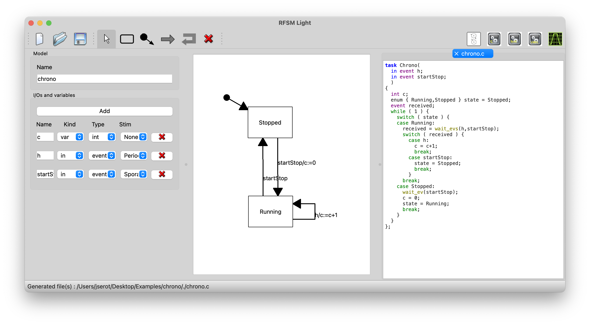
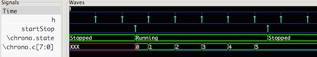

## RFSM-Light 

**RFSM-Light** is a simplified version of the [RFSM](https://github.com/jserot/rfsm) State Diagram
simulator and compiler. 

The main difference is the ability to describe state diagrams graphically using an
interface similar to that used in the [SSDE](https://github.com/jserot/ssde) editor.

On the other hand, and contrary to *RFSM*, **RFSM-Light** only handles systems composed of a *single
FSM* and hence does not support the abstraction facilities offered by the full RFSM language.
 
Apart from these differences, the underlying concepts and capabilities of the tools are similar.  In
particular, starting from a model of a system as a *reactive finite state machine* &mdash; *i.e.* a
set of *states* connected by *transitions* triggered by an *event* and a set boolean *guards* and
triggering a sequence of *actions* &mdash; *RFSM-Light* can

- generate a DOT representation of the model (to be viewed with [Graphviz](http://www.graphviz.org) for example)

- simulate the behavior of the model in response to stimuli attached to inputs (producing `.vcd`
files to be viewed using the [gtkwave](http://gtkwave.sourceforge.net) software

- generate description of the system (including *testbench* code when stimuli are attached to
  inputs) in

    - `CTask` (a C dialect with primitives for describing event-based synchronisation)

    - `SystemC`

    - `VHDL` 

## DOCUMENTATION

A minimalistic "Howto" is available
[here](https://github.com/jserot/rfsm-light/blob/master/doc/using.md)

This sequence of short videos can be used as tutorials
1. [This video](https://github.com/jserot/rfsm-light/releases/download/1.3.1/0-Chrono.mov) is an
   introduction, describing a simple model of a stopwatch, to be used in the sequel
2. [This video](https://github.com/jserot/rfsm-light/releases/download/1.3.1/1-Interface.mov) 
   briefly describes the GUI
3. [This video](https://github.com/jserot/rfsm-light/releases/download/1.3.1/2-SaisieModele.mov) and
   [this video](https://github.com/jserot/rfsm-light/releases/download/1.3.1/3-SaisieModele-suite.mov)
   show of to enter the model using the GUI
4. [This video](https://github.com/jserot/rfsm-light/releases/download/1.3.1/4-Visualisation.mov)
   shows how to redisplay the entered model in a nice way using [Graphviz](http://www.graphviz.org)
5. [This video](https://github.com/jserot/rfsm-light/releases/download/1.3.1/5-Simulation.mov) shows
   how to simulate the model and view simulation results using [gtkwave](http://gtkwave.sourceforge.net)
6. [This video](https://github.com/jserot/rfsm-light/releases/download/1.3.1/6-GenerationCode.mov)
   shows how to translate the model into C, SystemC or VHDL code 

## INSTALLATION

### Using binary versions

Prebuilt Windows and MacOS (Intel and M1) versions can be downloaded
[here](https://github.com/jserot/rfsm-light/releases) (check the `Assets` tab).

For Windows, a quick Install Guide is available
[here](https://github.com/jserot/rfsm-light/blob/master/dist/windows/windows-install-guide.pdf)

**Note** the [Graphviz](http://www.graphviz.org) package and the [gtkwave](http://gtkwave.sourceforge.net)
application (used, respectively, to display diagrams and viewing simulation results) are _not_
included in the distribution and must be installed separately. If you cannot (or don't want) to install
the `Graphviz` package, versions of **Rfsm-Light** using the [QGV](https://github.com/nbergont/qgv)
library instead are provided (the corresponding files have the `_qgv` suffix in the [corresponding
directory](https://github.com/jserot/rfsm-light/releases). These versions are provided only as
workarounds because the rendering is poorer than when using the external `Graphviz` package. 

### Building from source 

See [this file]((https://github.com/jserot/rfsm-light/BUILDING.md)
